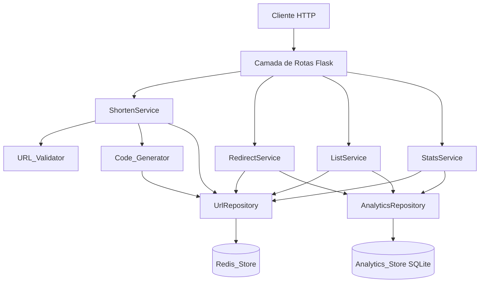
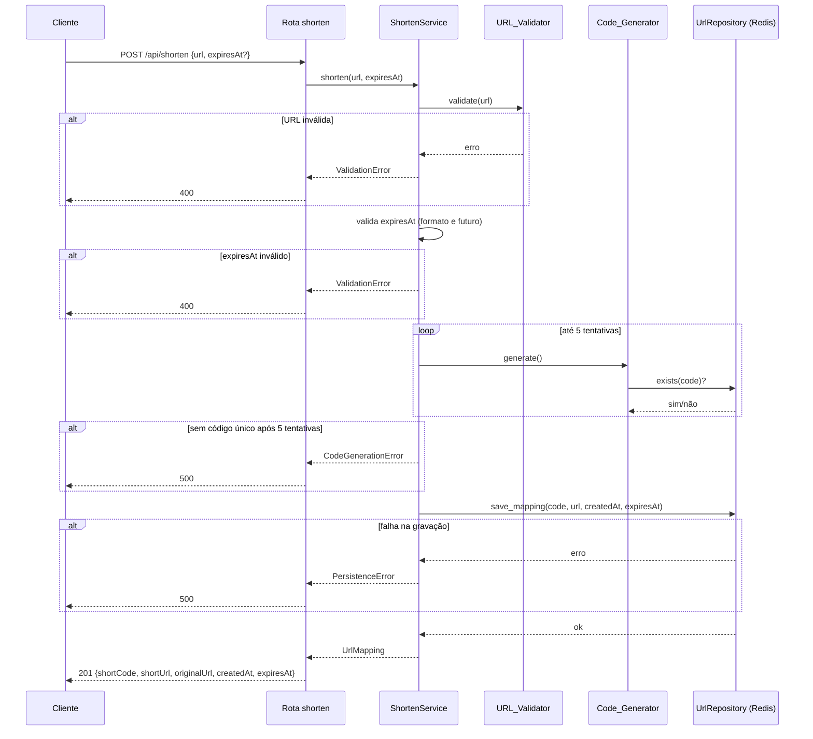
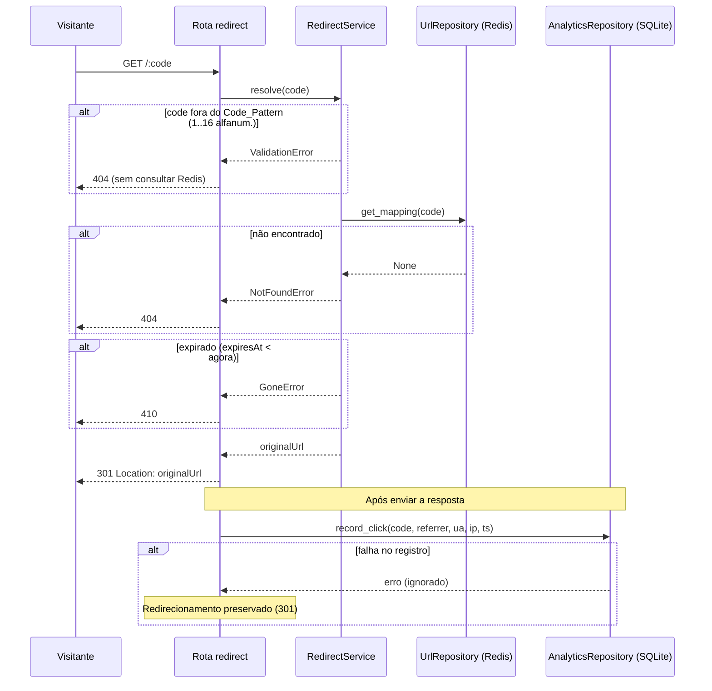

# Design Document

## Overview

Este documento descreve o design do backend do encurtador de URLs. O serviço é construído em **Python com Flask** e expõe uma API HTTP para encurtar URLs, redirecionar visitantes para a URL original e consultar estatísticas de acesso (analytics).

A arquitetura separa responsabilidades em três camadas (rotas → serviços → repositórios) e utiliza dois mecanismos de persistência distintos, cada um escolhido conforme o padrão de acesso:

- **Redis** (`Redis_Store`): mantém o mapeamento `Short_Code → metadados` (URL original, `createdAt`, `expiresAt`). O acesso é majoritariamente por chave (lookup direto no redirecionamento), padrão em que o Redis oferece baixa latência (atende ao requisito de persistência em até 500 ms — Requisito 6.1).
- **SQLite** (`Analytics_Store`): mantém os `Click_Records` (referrer, user-agent, IP, timestamp). As consultas de analytics exigem agregações (contagem por dia, top referrers), para as quais um banco relacional com SQL é mais adequado.

O escopo deste documento é **exclusivamente o backend**. O frontend será adicionado posteriormente e está fora do escopo.

### Decisões de design e justificativas

| Decisão | Justificativa |
|---|---|
| Redis para o mapeamento de URLs | Lookup por chave em O(1) no caminho crítico de redirecionamento; TTL nativo pode apoiar a expiração. Atende Requisito 6.1 (≤ 500 ms). |
| SQLite para analytics | Agregações (GROUP BY data, GROUP BY referrer) são naturais em SQL; separa a carga de escrita de cliques do caminho de leitura de redirecionamento. |
| Registro de clique após a resposta | O clique é registrado sem bloquear nem alterar o redirecionamento (Requisitos 2.5, 2.6, 6.3, 6.4). Falha no registro não afeta a resposta já enviada. |
| Camadas rotas/serviços/repositórios | Isola a lógica de negócio (pura e testável por propriedades) do framework e dos clientes de I/O (mockáveis nos testes — Requisito 7). |
| Short_Code de 7 caracteres `[A-Za-z0-9]` | Espaço de 62⁷ ≈ 3,5 × 10¹² combinações, tornando colisões raras; a geração reverifica unicidade com até 5 tentativas (Requisitos 1.2, 1.6, 1.9). |

## Architecture

### Visão em camadas

O backend adota uma arquitetura em camadas. As rotas (controllers Flask) lidam com HTTP; os serviços concentram a lógica de negócio; os repositórios encapsulam o acesso ao Redis e ao SQLite. Validadores e geradores são componentes puros reutilizados pelos serviços.



### Responsabilidades por camada

- **Rotas (`routes/`)**: traduzem requisições HTTP em chamadas de serviço, extraem corpo/query/headers, mapeiam o resultado ou erro de domínio para o status HTTP correto e serializam o JSON de resposta. Não contêm regra de negócio.
- **Serviços (`services/`)**: orquestram validação, geração de código, persistência e agregação. Contêm a lógica de negócio pura ou facilmente isolável (ex.: cálculo de paginação, agregação de estatísticas).
- **Repositórios (`repositories/`)**: encapsulam o I/O. `UrlRepository` fala com o Redis; `AnalyticsRepository` fala com o SQLite. Expõem métodos de domínio (ex.: `save_mapping`, `get_mapping`, `exists`, `record_click`, `count_clicks`).
- **Componentes de apoio**: `URL_Validator` e `Code_Generator`, funções/classes puras testáveis isoladamente.

### Estrutura de pastas e módulos

O projeto fica em uma pasta `backend` na raiz do workspace:

```text
backend/
├── app.py                      # Fábrica da aplicação Flask (create_app) e registro de blueprints
├── config.py                   # Configuração (BASE_URL, REDIS_URL, SQLITE_PATH, etc.)
├── requirements.txt            # Dependências (flask, redis, pytest, fakeredis, ...)
├── url_shortener/
│   ├── __init__.py
│   ├── routes/
│   │   ├── __init__.py
│   │   ├── shorten.py          # POST /api/shorten
│   │   ├── redirect.py         # GET /:code
│   │   ├── urls.py             # GET /api/urls
│   │   └── stats.py            # GET /api/stats/:code
│   ├── services/
│   │   ├── __init__.py
│   │   ├── shorten_service.py
│   │   ├── redirect_service.py
│   │   ├── list_service.py
│   │   └── stats_service.py
│   ├── repositories/
│   │   ├── __init__.py
│   │   ├── url_repository.py       # Redis
│   │   └── analytics_repository.py # SQLite
│   ├── domain/
│   │   ├── __init__.py
│   │   ├── validators.py       # URL_Validator, validação de code e de params de paginação
│   │   ├── code_generator.py   # Code_Generator
│   │   ├── models.py           # Dataclasses: UrlMapping, ClickRecord, PaginatedResult, Stats
│   │   └── errors.py           # Erros de domínio (ValidationError, NotFoundError, ...)
│   └── pagination.py           # Cálculo de offset/total/totalPages
└── tests/
    ├── __init__.py
    ├── conftest.py             # Fixtures: app, fakeredis, SQLite em memória
    ├── test_validators.py
    ├── test_code_generator.py
    ├── test_shorten.py
    ├── test_redirect.py
    ├── test_urls.py
    └── test_stats.py
```

### Fluxos principais

**Encurtamento (POST /api/shorten):**



**Redirecionamento (GET /:code):**



## Components and Interfaces

### URL_Validator (`domain/validators.py`)

Componente puro que valida a URL submetida ao encurtamento (Requisito 5).

```python
def validate_url(url: str | None) -> str:
    """
    Valida que `url` é não vazia, possui esquema http ou https e um host válido.
    Retorna a URL normalizada em caso de sucesso.
    Lança ValidationError se o esquema não for http/https (Req 5.2)
    ou se a URL for vazia/nula/sem host (Req 5.3).
    """
```

Regras:
- Esquema deve ser `http` ou `https` (comparação case-insensitive). Qualquer outro esquema é rejeitado (Req 1.3, 5.2).
- `netloc`/host deve estar presente. URL vazia, nula ou sem host é rejeitada (Req 1.4, 5.3).

Validadores auxiliares no mesmo módulo:

```python
def validate_code_pattern(code: str) -> bool:
    """True se code casa com [A-Za-z0-9]{1,16} (Code_Pattern). (Req 2.4, 4.5)"""

def parse_expires_at(value: str | None, now: datetime) -> datetime | None:
    """
    None se value ausente. Faz parse ISO 8601.
    Lança ValidationError se o formato for inválido (Req 1.7)
    ou se o instante for <= now (Req 1.8).
    """

def parse_pagination(page_raw, page_size_raw) -> tuple[int, int]:
    """
    Aplica defaults (page=1, pageSize=50) e limite (pageSize<=100).
    Lança ValidationError se page/pageSize não numérico ou < 1 (Req 3.8, 3.9).
    """
```

### Code_Generator (`domain/code_generator.py`)

Gera o `Short_Code` alfanumérico de 7 caracteres e garante unicidade consultando o repositório (Requisitos 1.2, 1.6, 1.9).

```python
ALPHABET = string.ascii_letters + string.digits  # [A-Za-z0-9], 62 símbolos
CODE_LENGTH = 7
MAX_RETRIES = 5

def generate_code(rng=secrets) -> str:
    """Gera uma sequência aleatória de 7 caracteres de ALPHABET."""

def generate_unique_code(exists: Callable[[str], bool], rng=secrets) -> str:
    """
    Gera códigos até encontrar um que `exists(code)` seja False,
    em no máximo 5 tentativas. Lança CodeGenerationError se as 5
    tentativas colidirem (Req 1.9).
    """
```

A injeção de `exists` (um callable sobre o `UrlRepository`) e `rng` mantém o gerador testável sem Redis real.

### UrlRepository (`repositories/url_repository.py`) — Redis

Encapsula o `Redis_Store`.

```python
class UrlRepository:
    def __init__(self, redis_client): ...

    def exists(self, code: str) -> bool: ...

    def save_mapping(self, mapping: UrlMapping) -> None:
        """Grava o mapeamento. Lança PersistenceError em falha (Req 6.2)."""

    def get_mapping(self, code: str) -> UrlMapping | None:
        """Retorna o mapeamento ou None se o code não existir."""

    def list_mappings(self) -> list[UrlMapping]:
        """
        Retorna todos os mapeamentos para ordenação/paginação em memória.
        Lança DataSourceError em indisponibilidade (Req 3.12).
        """
```

### AnalyticsRepository (`repositories/analytics_repository.py`) — SQLite

Encapsula o `Analytics_Store`.

```python
class AnalyticsRepository:
    def __init__(self, connection): ...

    def record_click(self, click: ClickRecord) -> None:
        """
        Insere um Click_Record. Pode falhar silenciosamente no fluxo de
        redirecionamento (Req 2.6, 6.4) — o chamador trata/ignora o erro.
        """

    def count_clicks(self, code: str) -> int:
        """Click_Count do code (>= 0)."""

    def count_clicks_bulk(self, codes: list[str]) -> dict[str, int]:
        """Contagem de cliques por code para a listagem paginada."""

    def clicks_by_day(self, code: str, since: datetime) -> list[DayCount]:
        """Cliques agrupados por dia desde `since`, crescente por data (Req 4.2)."""

    def top_referrers(self, code: str, limit: int = 10) -> list[ReferrerCount]:
        """Top referrers por contagem, decrescente, no máximo `limit` (Req 4.3)."""
```

### Serviços

- **ShortenService**: valida URL e `expiresAt`, gera código único, monta `UrlMapping` (com `createdAt = now` UTC) e persiste. Retorna o mapeamento ou lança erro de domínio.
- **RedirectService**: valida o `Code_Pattern`, busca o mapeamento, verifica expiração e devolve a `originalUrl`. O registro do clique é acionado pela rota após a resposta.
- **ListService**: obtém mapeamentos, ordena (decrescente por `createdAt`, desempate decrescente por `shortCode` — Req 3.2), aplica paginação e enriquece cada item com `clickCount`.
- **StatsService**: verifica existência do code, calcula `totalClicks`, `clicksByDay` (últimos 30 dias) e `topReferrers` (máx. 10).

### Contratos da API

#### POST /api/shorten

- **Request body**: `{ "url": string, "expiresAt"?: string (ISO 8601) }`
- **201 Created**:
  ```json
  {
    "shortCode": "aB3xZ9k",
    "shortUrl": "https://host/aB3xZ9k",
    "originalUrl": "https://exemplo.com/pagina",
    "createdAt": "2025-01-10T12:00:00Z",
    "expiresAt": "2025-02-10T12:00:00Z"
  }
  ```
  `expiresAt` é `null` quando não fornecido.
- **400**: URL ausente/vazia (Req 1.4), esquema inválido ou sem host (Req 1.3), `expiresAt` com formato inválido (Req 1.7) ou não futuro (Req 1.8).
- **500**: falha ao gerar código único após 5 tentativas (Req 1.9) ou falha de persistência no Redis (Req 6.2).

#### GET /:code

- **301 Moved Permanently**: cabeçalho `Location` = `originalUrl` (Req 2.1). Clique registrado após a resposta (Req 2.5).
- **404**: code fora do `Code_Pattern` (Req 2.4, sem consultar Redis) ou code inexistente (Req 2.2).
- **410 Gone**: code expirado (Req 2.3, 6.5).

#### GET /api/urls

- **Query params**: `page` (default 1), `pageSize` (default 50, máx. 100).
- **200 OK**:
  ```json
  {
    "items": [
      {
        "shortCode": "aB3xZ9k",
        "shortUrl": "https://host/aB3xZ9k",
        "originalUrl": "https://exemplo.com",
        "createdAt": "2025-01-10T12:00:00Z",
        "expiresAt": null,
        "clickCount": 42
      }
    ],
    "page": 1,
    "pageSize": 50,
    "total": 123,
    "totalPages": 3
  }
  ```
  Lista vazia quando a página excede o total (Req 3.10) ou não há URLs (Req 3.11).
- **400**: `page` ou `pageSize` não numérico ou < 1 (Req 3.8, 3.9).
- **503**: origem de dados indisponível (Req 3.12).

#### GET /api/stats/:code

- **200 OK**:
  ```json
  {
    "totalClicks": 42,
    "clicksByDay": [
      { "date": "2025-01-09", "count": 10 },
      { "date": "2025-01-10", "count": 32 }
    ],
    "topReferrers": [
      { "referrer": "https://twitter.com", "count": 20 }
    ]
  }
  ```
  `clicksByDay` crescente por data (Req 4.2); `topReferrers` decrescente por contagem, máx. 10 (Req 4.3). Listas vazias e `totalClicks` = 0 quando não há cliques (Req 4.6).
- **400**: code fora do `Code_Pattern` (Req 4.5).
- **404**: code inexistente (Req 4.4).

## Data Models

### Modelos de domínio (`domain/models.py`)

```python
@dataclass(frozen=True)
class UrlMapping:
    short_code: str
    original_url: str
    created_at: datetime      # UTC
    expires_at: datetime | None

@dataclass(frozen=True)
class ClickRecord:
    short_code: str
    referrer: str | None
    user_agent: str | None
    ip: str | None
    timestamp: datetime       # UTC

@dataclass(frozen=True)
class DayCount:
    date: str                 # "YYYY-MM-DD"
    count: int

@dataclass(frozen=True)
class ReferrerCount:
    referrer: str
    count: int

@dataclass(frozen=True)
class PaginatedResult:
    items: list[dict]
    page: int
    page_size: int
    total: int
    total_pages: int
```

### Esquema de chaves do Redis (`Redis_Store`)

Cada mapeamento é armazenado como um **Hash** indexado pelo `Short_Code`:

| Chave | Tipo | Campos | Observação |
|---|---|---|---|
| `url:{shortCode}` | Hash | `originalUrl`, `createdAt` (ISO 8601 UTC), `expiresAt` (ISO 8601 UTC ou vazio) | Mapeamento principal. `exists` checa a existência desta chave. |

Para suportar a listagem ordenada (`GET /api/urls`), mantém-se um índice auxiliar por data de criação:

| Chave | Tipo | Membro / Score | Observação |
|---|---|---|---|
| `urls:index` | Sorted Set | membro = `shortCode`, score = epoch de `createdAt` | Permite recuperar os códigos ordenados por `createdAt`. O desempate decrescente por `shortCode` (Req 3.2) é aplicado na camada de serviço. |

Notas de design:
- A expiração é verificada **na aplicação** no momento do redirecionamento (comparando `expiresAt` com o instante atual — Req 2.3, 6.5), garantindo o status 410 em vez de 404. Opcionalmente, um TTL do Redis pode ser definido para limpeza, mas a verificação explícita é a fonte de verdade do status.
- `createdAt` e `expiresAt` são persistidos em ISO 8601 UTC.

### Esquema do SQLite (`Analytics_Store`)

```sql
CREATE TABLE IF NOT EXISTS clicks (
    id         INTEGER PRIMARY KEY AUTOINCREMENT,
    short_code TEXT    NOT NULL,
    referrer   TEXT,
    user_agent TEXT,
    ip         TEXT,
    timestamp  TEXT    NOT NULL   -- ISO 8601 UTC
);

CREATE INDEX IF NOT EXISTS idx_clicks_code      ON clicks (short_code);
CREATE INDEX IF NOT EXISTS idx_clicks_code_time ON clicks (short_code, timestamp);
```

- `short_code` indexado para contagem e agregações por URL.
- Índice composto `(short_code, timestamp)` acelera `clicksByDay` dos últimos 30 dias (Req 4.2).
- `referrer`, `user_agent` e `ip` são anuláveis — nem toda requisição fornece esses cabeçalhos (Req 2.5).

## Correctness Properties

*Uma propriedade é uma característica ou comportamento que deve ser verdadeiro em todas as execuções válidas do sistema — essencialmente, uma afirmação formal sobre o que o sistema deve fazer. As propriedades servem de ponte entre especificações legíveis por humanos e garantias de correção verificáveis por máquina.*

As propriedades abaixo derivam da análise de prework das acceptance criteria. Critérios de latência (Req 6.1, 6.3) são verificados por testes de integração; os requisitos sobre a própria suíte de testes (Req 7) são atendidos pela estratégia de testes. Redundâncias foram consolidadas (ex.: 5.2 em 1.3; 6.4 em 2.6; 6.5 em 2.3; 3.10 em 3.5).

### Property 1: Short_Code sempre tem 7 caracteres alfanuméricos

*For all* execuções do Code_Generator, o Short_Code gerado possui exatamente 7 caracteres e todos pertencem ao conjunto `[A-Za-z0-9]`.

**Validates: Requirements 1.2**

### Property 2: Geração de código único evita colisões e sinaliza saturação

*For any* conjunto de Short_Codes já existentes, se há pelo menos um código disponível dentro de 5 tentativas, o código retornado por `generate_unique_code` não pertence ao conjunto existente; e *for any* estado em que todas as tentativas colidem, a geração lança `CodeGenerationError` após no máximo 5 tentativas sem persistir mapeamento.

**Validates: Requirements 1.6, 1.9**

### Property 3: URLs http/https com host são aceitas

*For any* URL cujo esquema seja `http` ou `https` e que possua um host válido, o URL_Validator aceita a URL e retorna sua forma normalizada.

**Validates: Requirements 1.1, 5.1**

### Property 4: URLs com esquema não suportado ou sem host são rejeitadas

*For any* URL cujo esquema seja diferente de `http`/`https`, ou que seja nula/vazia/sem host, o URL_Validator a rejeita com erro de validação e nenhum mapeamento é persistido.

**Validates: Requirements 1.3, 1.4, 5.2, 5.3**

### Property 5: expiresAt inválido ou não futuro é rejeitado

*For any* valor de `expiresAt` que não seja uma data ISO 8601 válida, ou que represente um instante igual ou anterior ao horário atual do servidor, a operação de encurtamento é rejeitada com status 400 e nenhum mapeamento é persistido.

**Validates: Requirements 1.7, 1.8**

### Property 6: Round-trip encurtar → redirecionar preserva a URL original

*For any* URL válida e `expiresAt` ausente ou futuro, após encurtar e persistir o mapeamento, uma requisição de redirecionamento para o Short_Code resultante responde com status 301 e cabeçalho `Location` igual à Original_URL fornecida; adicionalmente, o `expiresAt` persistido é igual ao fornecido.

**Validates: Requirements 1.1, 1.5, 2.1**

### Property 7: Códigos inexistentes ou inválidos no redirecionamento

*For any* Short_Code que respeite o Code_Pattern mas não exista no Redis_Store, o redirecionamento retorna 404; e *for any* code que viole o Code_Pattern (fora de 1 a 16 caracteres alfanuméricos), o redirecionamento retorna 404 sem consultar o Redis_Store.

**Validates: Requirements 2.2, 2.4**

### Property 8: Códigos expirados retornam 410

*For any* mapeamento cujo `expiresAt` seja anterior ao instante atual, o redirecionamento retorna status 410.

**Validates: Requirements 2.3, 6.5**

### Property 9: Redirecionamento registra o clique com os dados da requisição

*For any* redirecionamento bem-sucedido (301), é registrado no Analytics_Store exatamente um Click_Record cujos campos referrer, user-agent, IP e timestamp correspondem aos valores da requisição.

**Validates: Requirements 2.5**

### Property 10: Falha ao registrar o clique não altera o redirecionamento

*For any* redirecionamento válido, mesmo que o registro do Click_Record falhe, a resposta permanece 301 com o `Location` correto e o estado do Redis_Store permanece inalterado.

**Validates: Requirements 2.6, 6.4**

### Property 11: Itens da listagem contêm todos os campos exigidos

*For any* conjunto de URLs encurtadas, cada item retornado por `GET /api/urls` contém `shortCode`, `shortUrl`, `originalUrl`, `createdAt` (ISO 8601 UTC), `expiresAt` (ISO 8601 UTC ou nulo) e `clickCount` inteiro maior ou igual a 0.

**Validates: Requirements 3.1**

### Property 12: A listagem é ordenada por createdAt e shortCode decrescentes

*For any* conjunto de URLs encurtadas, a lista completa (antes da paginação) está ordenada de forma decrescente por `createdAt` e, em caso de empate, de forma decrescente por `shortCode`.

**Validates: Requirements 3.2**

### Property 13: A paginação corresponde ao recorte da lista ordenada

*For any* conjunto de URLs e quaisquer `page` e `pageSize` válidos, os itens retornados são iguais ao recorte `[(page-1)*pageSize : (page-1)*pageSize + pageSize]` da lista ordenada de referência, e a quantidade de itens retornados é no máximo `pageSize` (resultando em lista vazia quando a página excede o total).

**Validates: Requirements 3.5, 3.10**

### Property 14: pageSize é limitado a 100

*For any* `pageSize` fornecido com valor maior que 100, o `pageSize` efetivo aplicado e refletido nos metadados é 100.

**Validates: Requirements 3.7**

### Property 15: Metadados de paginação são consistentes

*For any* conjunto de URLs e parâmetros válidos, a resposta inclui `page`, `pageSize`, `total` igual ao número real de URLs existentes e `totalPages` igual a `ceil(total / pageSize)`.

**Validates: Requirements 3.6**

### Property 16: Parâmetros de paginação inválidos são rejeitados

*For any* valor de `page` ou `pageSize` que seja não numérico ou menor que 1, `GET /api/urls` retorna status 400 e nenhuma lista é retornada.

**Validates: Requirements 3.8, 3.9**

### Property 17: Estatísticas de código existente possuem a estrutura exigida

*For any* Short_Code existente, `GET /api/stats/:code` retorna status 200 com `totalClicks` inteiro maior ou igual a 0, `clicksByDay` (lista) e `topReferrers` (lista).

**Validates: Requirements 4.1, 4.6**

### Property 18: clicksByDay cobre os últimos 30 dias em ordem crescente

*For any* conjunto de Click_Records de um Short_Code, `clicksByDay` contém somente datas dentro dos últimos 30 dias a partir da data da requisição, está ordenado de forma crescente por data, e a soma de suas contagens é igual ao número de cliques ocorridos nessa janela.

**Validates: Requirements 4.2**

### Property 19: topReferrers agrega corretamente e limita a 10

*For any* conjunto de Click_Records de um Short_Code, `topReferrers` contém no máximo 10 itens, está ordenado de forma decrescente por contagem, e a contagem de cada referrer é igual ao número de cliques daquele referrer.

**Validates: Requirements 4.3**

### Property 20: Estatísticas de código inexistente ou inválido

*For any* Short_Code que respeite o Code_Pattern mas não exista, `GET /api/stats/:code` retorna 404; e *for any* code vazio ou fora de 1 a 16 caracteres alfanuméricos, retorna 400.

**Validates: Requirements 4.4, 4.5**

### Property 21: Falha de persistência no Redis rejeita o encurtamento

*For any* operação de encurtamento em que a gravação no Redis_Store falhe, o Backend rejeita a operação, não retorna um Short_Code válido e sinaliza erro de persistência.

**Validates: Requirements 6.2**

## Error Handling

A lógica de negócio lança **erros de domínio** (em `domain/errors.py`); a camada de rotas os traduz para o status HTTP correto. Todos os corpos de erro seguem o formato `{ "error": "<mensagem>" }`.

### Erros de domínio e mapeamento HTTP

| Erro de domínio | Causa | Endpoint(s) | Status HTTP | Requisitos |
|---|---|---|---|---|
| `ValidationError` (URL) | URL ausente/vazia, esquema != http/https, sem host | POST /api/shorten | 400 | 1.3, 1.4, 5.2, 5.3 |
| `ValidationError` (expiresAt) | Formato de data inválido ou instante não futuro | POST /api/shorten | 400 | 1.7, 1.8 |
| `ValidationError` (code) | Code fora do Code_Pattern | GET /api/stats/:code | 400 | 4.5 |
| `ValidationError` (paginação) | `page`/`pageSize` não numérico ou < 1 | GET /api/urls | 400 | 3.8, 3.9 |
| `NotFoundError` | Code inexistente | GET /:code, GET /api/stats/:code | 404 | 2.2, 4.4 |
| `InvalidCodeError` | Code fora do Code_Pattern (redirect) | GET /:code | 404 (sem consultar Redis) | 2.4 |
| `GoneError` | Code expirado | GET /:code | 410 | 2.3, 6.5 |
| `CodeGenerationError` | Sem code único após 5 tentativas | POST /api/shorten | 500 | 1.9 |
| `PersistenceError` | Falha ao gravar no Redis | POST /api/shorten | 500 | 6.2 |
| `DataSourceError` | Origem de dados indisponível | GET /api/urls | 503 | 3.12 |

### Estratégias específicas

- **Registro de clique resiliente (Req 2.6, 6.4)**: o `record_click` é chamado após a resposta de redirecionamento já ter sido montada/enviada e é envolvido em try/except que apenas registra log do erro. Qualquer falha de I/O no SQLite não altera o status 301 nem o estado do Redis.
- **Validação antes de I/O**: validação de URL, de `expiresAt`, do Code_Pattern e dos parâmetros de paginação ocorre antes de qualquer acesso a Redis/SQLite. No redirect, isso garante o 404 por padrão inválido sem consultar o Redis (Req 2.4).
- **Diferenciação 404 vs 410**: a expiração é verificada após recuperar o mapeamento; mapeamento ausente → 404, mapeamento presente e expirado → 410.
- **Indisponibilidade de dados (Req 3.12)**: erros de conexão/leitura no Redis ou no SQLite durante a listagem são capturados pelos repositórios e convertidos em `DataSourceError` → 503, sem retornar lista parcial.
- **Error handler global**: um handler Flask (`@app.errorhandler`) centraliza a conversão de erros de domínio não tratados em respostas JSON com o status apropriado, evitando vazamento de stack traces.

## Testing Strategy

A estratégia combina **testes unitários baseados em exemplos** (casos específicos, edge cases e condições de erro) com **testes baseados em propriedades** (cobertura universal das propriedades acima), atendendo ao Requisito 7.

### Ferramentas

- **pytest** como test runner (reporta aprovado/reprovado por caso — Req 7.3).
- **Hypothesis** como biblioteca de property-based testing para Python (não implementar PBT do zero).
- **fakeredis** para simular o Redis nos testes do `UrlRepository` e dos serviços, sem servidor real.
- **SQLite em memória** (`sqlite3.connect(":memory:")`) para o `AnalyticsRepository`, criando o schema por teste/fixture.
- **unittest.mock** para injetar repositórios que falham (simular `PersistenceError`, `DataSourceError`, falha de `record_click`) e para spies (verificar que o Redis não é consultado em codes inválidos — Property 7).

### Configuração dos testes de propriedade

- Cada propriedade da seção **Correctness Properties** é implementada por **um único teste de propriedade**.
- Cada teste de propriedade executa **no mínimo 100 iterações** (configuração `@settings(max_examples=100)` do Hypothesis).
- Cada teste de propriedade é anotado com um comentário referenciando a propriedade do design, no formato:

  `# Feature: url-shortener, Property {número}: {texto da propriedade}`

- Geradores (strategies) do Hypothesis cobrem os edge cases identificados no prework: URLs com esquemas diversos, URLs sem host, strings de data malformadas, datas passadas/futuras, codes fora do padrão, conjuntos de URLs com `createdAt` repetidos, `pageSize` acima de 100, cliques dentro e fora da janela de 30 dias e referrers repetidos.

### Testes baseados em exemplos (unitários)

Cobrem itens classificados como EXAMPLE/EDGE_CASE e os pontos de integração:

- Defaults de paginação: sem `page` → `page=1` (Req 3.3); sem `pageSize` → `pageSize=50` (Req 3.4).
- Lista vazia: repositório sem URLs → `items=[]`, `total=0` (Req 3.11).
- `url` ausente/vazia/espaços → 400 (Req 1.4).
- Estatísticas de code existente sem cliques → `totalClicks=0`, listas vazias (Req 4.6).
- Indisponibilidade de dados → 503 (Req 3.12), via mock que lança `DataSourceError`.
- Pelo menos um caso de sucesso e um de erro por função principal e por endpoint (Req 7.1, 7.2): geração de código, validação de URL, encurtamento, redirecionamento, registro de clique, listagem e cálculo de estatísticas.

### Testes de integração

Para critérios de latência e de I/O real (não adequados a PBT):

- Gravação do mapeamento no Redis e verificação de que ocorre dentro do limite (Req 6.1).
- Registro do Click_Record no SQLite e verificação de que ocorre dentro do limite (Req 6.3).

Estes usam 1 a 3 exemplos representativos; a verificação de latência é feita em ambiente real/aproximado, não por múltiplas iterações.

### Mapeamento de cobertura

| Função principal | Teste de propriedade | Teste de exemplo |
|---|---|---|
| Code_Generator | Properties 1, 2 | sucesso/colisão simulada |
| URL_Validator | Properties 3, 4 | url vazia/None (Req 1.4) |
| Encurtamento | Properties 5, 6, 21 | 400 por url vazia; 500 por falha |
| Redirecionamento | Properties 6, 7, 8, 9, 10 | 404/410 exemplos |
| Registro de clique | Properties 9, 10 | falha de gravação |
| Listagem | Properties 11–16 | defaults, vazio, 503 |
| Estatísticas | Properties 17–20 | sem cliques (Req 4.6) |
